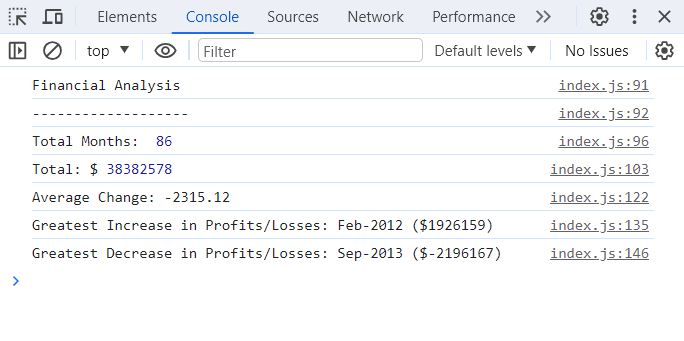

# **[Console-Finances](https://imogenc0.github.io/Console-Finances/)**

## Description

This project includes code that analyses financial records for a company, providing the following information:

- Total Months
- Total $
- Average Change
- Greatest Increase in Profits/Losses
- Greatest Decrease in Profits/Losses

## Installation

N/A

## Usage

1. Firstly, open [Console Finances](https://imogenc0.github.io/Console-Finances/) in your browser.

The following page should appear:

2. Now you have the page open in the browser, open the console using F12 or right click and select 'Inspect'.

The following page should appear:

3. Navigate to the 'Console' tab as highlighted in the screenshot below:
   

4. The Console now displays the JavaScript console.log code that analyses the financial data.

Financial Analysis in console:

## Credits

N/A

## Liscence

MIT Liscence - please see liscence documentation for more details.
